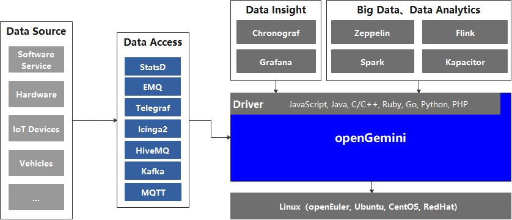

# README

                                                                                                                                     

[简体中文](README_CN.md) | [English]()

[Official Website](http://www.openGemini.org) | [Docs](http://www.openGemini.org/docs) | [Contribution Guide](http://www.openGemini.org/contribution) 


## About openGemini

OpenGemini is an open-source time-series database that can be widely used in IoT, Internet of Vehicles(IoV), O&M monitoring, and industrial Internet scenarios. It has excellent read/write performance and efficient data analysis capabilities. It uses an SQL-like query language, does not rely on third-party software, and is easy to install, deploy, and maintain. We encourage contribution and collaboration to the community.

## Why openGemini

- High-performance read and write
  - 10-million-scale concurrent writes of metrics per second
  - Millisecond-level response for querying tens of thousands of sensors data
- Supports time-series data analysis
  - Built-in AI data analysis algorithm
  - Supports real-time abnormality detection and prediction of time-series data
- Ecosystem compatibility
  - Compatible with InfluxDB line protocol and Influxql
  - Seamless integration with existing InfluxDB toolchain
  - Supports promethus remote read/write API
- Efficient management  of massive time series data
  - Supports 100-million-scale time series management
  - Built-in efficient data compression algorithm, with a storage cost of only 1/20 compared to traditional databases
- Distributed
  - Provides horizontal scalability and supports hundreds of nodes in a cluster
- Flexible deployment
  - Runs the executable binary files without external dependencies
  - All the configuration is done with reasonable defaults
  - Supports single-node and cluster deployment

## Third-party supports



currently openGemini only supports Linux OS, and supports InfluxDB ecosystem toolchains, such as:

Drivers: [JavaScript](https://github.com/node-influx/node-influx), [Java](https://github.com/influxdata/influxdb-java), [C/C++](C/C++), [Ruby](https://github.com/influxdata/influxdb-ruby), [Go](https://github.com/influxdata/influxdb1-client), [Python](https://github.com/influxdata/influxdb-python), [PHP](https://github.com/influxdata/influxdb-php)

Client: Influx

Data access tools: StatsD, EMQ, Telegraf, Icinga2, HiveMQ, Kafka, MQTT

Data insight tools: Chronograf, Grafana

Big data and data analysis systems: Zeppelin, Flink, Spark, Kapacitor, etc.

## Quick Start

For a more detailed introduction, please visit our official website [User Guide](http://www.openGemini.org/docs)

This section mainly contains the following:

- How to compile openGemini source code
- How to run openGemini

### Compiling environment information

[GO](https://golang.org/dl/) version v1.16+

[Python](https://www.python.org/downloads/) version v2.7+

**How to set GO environment variables**

Open ~/.profile configuration file and add the following configurations to the end of the file:

```
export GOPATH=/path/to/dir
export GOBIN=$GOPATH/bin
export GO111MODULE=on
export GONOSUMDB=*
export GOSUMDB=off
```

### Compiling

1. Clone source codes from Github

```
> cd $GOPATH
> mkdir -p {pkg,bin,src}
> cd src
> git clone https://github.com/openGemini/openGemini.git
```

2. Enter the home directory

```
> cd openGemini
```

3. Compiling

```
> export CGO_LDFLAGS="-Wl,-z,now -Wl,-z,relro -Wl,-z,noexecstack -fPIE -ftrapv"
> export CGO_CFLAGS="-fstack-protector-strong -D_FORTIFY_SOURCE=2 -O2"
> python build.py
```

The compiled binary file is in the build directory

```
> ls build
ts-cli  ts-meta  ts-server  ts-sql  ts-store
```

### Configuration

The configuration file is in the conf directory. For more information about the configuration items, please refer to [User Guide --> Configuration Files](http://opengemini.org/docs)

### Run openGemini

Standalone operation

```
> cd openGemini
> mkdir -p /tmp/openGemini
> sh scripts/install.sh
```

Refer to cluster deployments in [User Guide](http://opengemini.org/docs)

#### Using openGemini

Use the client to connect to openGemini

```shell
> influx -host 127.0.0.1 -port 8086
```

After successful login, the following message will be displayed

```sh
> influx -host 127.0.0.1 -port 8086
WARN: Connected to http://127.0.0.1:8086, but found no server version.
Are you sure an InfluxDB server is listening at the given address?
InfluxDB shell version: 1.8.3
> 
```

#### Demo


Create a database

```
> create database sensordb
> use sensordb
```

The openGemini supports three ways for creating a measurement.

- Implicit creation, automatic creation measurement when data is written. By default, partition is based on time.
- explicit creation, without specifying the partition key, as the same as implicit creation.

```
> create measurement sensor
```

- explicit creation, specifying partition keys during table creation, During data storage, the table will be primarily partitioned by time, and then secondarily partitioned according to the specified partition keys.

```shell
> create measurement sensor with shardkey farmID
```

Write data

```
> insert sensor,farmID="001",device="110" sensorId="s20",value=50.98
```

Query data

```
> select * from sensor
name: sensor
time                device farmID sensorId value
----                ------ ------ -------- -----
1664285811060281356 "110"  "001"  s20      50.98
```

## Join & Contribute

[Tips for Contribution](CONTRIBUTION.md)

## Contact Us

1. [Slack](https://join.slack.com/t/huawei-ipz9493/shared_invite/zt-1bvxs3s0i-h0BzP7ibpWfqmpJO2a4iKw)

2. [Twitter](https://twitter.com/openGemini)

## License

openGemini is licensed under the Apache License 2.0. Refer to [LICENSE](https://github.com/openGemini/openGemini/blob/main/LICENSE) for more details.

