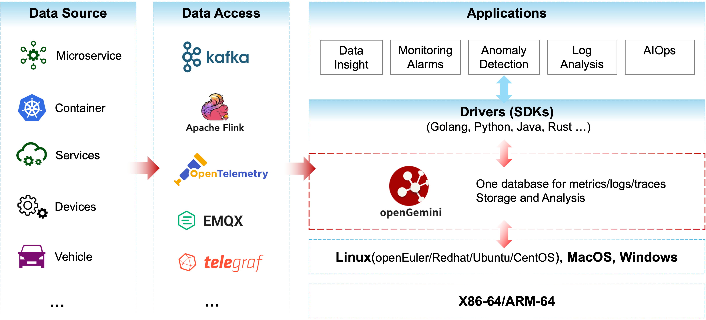

# README


                                                                                                     
[简体中文](README_CN.md) | English

[Official Website](http://www.openGemini.org) | [Docs](https://docs.opengemini.org/guide) | [Contribution Guide](CONTRIBUTION.md) | [RoadMap](./ROADMAP.md) | [Performance](https://docs.opengemini.org/guide/introduction/performance.html)


  <picture>
    <source media="(prefers-color-scheme: dark)" srcset="https://next.ossinsight.io/widgets/official/compose-activity-trends/thumbnail.png?repo_id=507829396&image_size=auto&color_scheme=dark" width="815" height="auto">
    
  </picture>


## About openGemini

openGemini is a cloud-native distributed time series database for Observability, focusing on the storage and analysis of massive telemetry data. 

If you have used openGemini, please let us know and [click Submit Usage Information](https://github.com/openGemini/openGemini/issues/62)

## Why openGemini

Compared with other time series database, openGemini has the following advantages:

- #### High Performance

  Store and query data quickly and efficiently with automatic partitioning, LSM-based storage techniques,  and better data process engineering, see[performance reports](https://docs.opengemini.org/guide/introduction/performance.html)

- #### High Scalability

  Adopting MPP architecture, support distributed cluster deployment and can be flexibly expanded as business grows to meet higher load requirements, see [Architecture](https://docs.opengemini.org/guide/introduction/structure.html)

- #### High Cardinality

  A new high cardinality storage engine solves problems such as excessive index memory usage and low read and write performance, see [high cardinality storage engine](https://docs.opengemini.org/guide/features/high_series_cardinality.html)

- #### Data Compression

  Data is stored in column format, and different data types use dedicated data compression algorithms. The data compression ratio is as high as 15:1 or higher, see [Data compression algorithm](https://docs.opengemini.org/guide/kernel/data_compress.html)

- #### Flexible Deployment

  Supports stand-alone and cluster deployment, and supports various forms of deployment such as virtual machines, physical machines, containers, and clouds. Provides one-click container deployment tool ([openGemini-operator](https://github.com/openGemini/openGemini-operator)) and one-click normal installation and deployment tool ([gemix](https://github.com/openGemini/gemix))

- #### Ecosystem compatibility

  Compatible with **InfluxDB** v1.x Line Protocol, Influxql and read/write APIs, also compatible with existing **InfluxDB toolchain**, supports **prometheus** remote read/write API and **openTelemetry** standard protocol

## Application Scenes



## Quick Start

For a more detailed introduction, please visit our official website [User Guide](https://docs.opengemini.org/guide/quick_start/get_started.html)

This section mainly contains the following:

- How to compile openGemini source code
- How to run openGemini

### Compiling environment information

[GO](https://golang.org/dl/) version v1.19+

[Python](https://www.python.org/downloads/) version v3.7+

#### How to set GO environment variables

Open ~/.profile configuration file and add the following configurations to the end of the file:

```
export GOPATH=/path/to/dir
export GOBIN=$GOPATH/bin
export GO111MODULE=on
export GONOSUMDB=*
export GOSUMDB=off
```

### Compiling

1. Clone source codes from Github

```
> cd $GOPATH
> mkdir -p {pkg,bin,src}
> cd src
> git clone https://github.com/openGemini/openGemini.git
```

2. Enter the home directory

```
> cd openGemini
```

3. Compiling

```
> export CGO_LDFLAGS="-Wl,-z,now -Wl,-z,relro -Wl,-z,noexecstack -fPIE -ftrapv"
> export CGO_CFLAGS="-fstack-protector-strong -D_FORTIFY_SOURCE=2 -O2"
> python build.py
```

The compiled binary file is in the build directory

```
> ls build
ts-cli ts-meta ts-monitor ts-server  ts-sql  ts-store
```

### Configuration

The configuration file is in the conf directory. For more information about the configuration items, please refer to [User Guide --> Reference --> Configuration Files](https://docs.opengemini.org/guide/reference/configurations.html)

### Run openGemini

Standalone operation

```
> cd openGemini
> mkdir -p /tmp/openGemini
> sh scripts/install.sh
```

Refer to cluster deployments in [User Guide](https://docs.opengemini.org/guide/quick_start/get_started.html)

#### Using openGemini

Use the client to connect to openGemini

```shell
> ts-cli --host 127.0.0.1 --port 8086
```

After successful login, the following message will be displayed

```sh
> ts-cli --host 127.0.0.1 --port 8086
openGemini CLI 0.1.0 (rev-revision)
Please use 'quit', 'exit' or 'Ctrl-D' to exit this program
> 
```

Create a database

```
> create database sensordb
> use sensordb
```

The openGemini supports three ways for creating a measurement.

- Implicit creation, automatic creation measurement when data is written. By default, partition is based on time.
- explicit creation, without specifying the partition key, as the same as implicit creation.

```
> create measurement sensor
```

- explicit creation, specifying partition keys during table creation, During data storage, the table will be primarily partitioned by time, and then secondarily partitioned according to the specified partition keys.

```shell
> create measurement sensor with shardkey farmID
```

Write data

```
insert sensor,farmID=f1,deviceID=d0 sensorID="s20",value=50.98
```

Query data

```
> select * from sensor
name: sensor
+---------------------+----------+--------+----------+-------+
| time                | deviceID | farmID | sensorID | value |
+---------------------+----------+--------+----------+-------+
| 1657959880895515464 | d0       | f1     | s20      | 50.98 |
+---------------------+----------+--------+----------+-------+
5 columns,1 rows in set
Elapsed: 7.723332ms  
```

## Join & Contribute

[Tips for Contribution](CONTRIBUTION.md)

## Contact Us

1. [Slack](https://join.slack.com/t/huawei-ipz9493/shared_invite/zt-1bvxs3s0i-h0BzP7ibpWfqmpJO2a4iKw)

2. [Twitter](https://twitter.com/openGemini)

3. [Email](mailto:community.ts@opengemini.org)

4. [mailing list](https://groups.google.com/g/openGemini)


## License

openGemini is licensed under the Apache License 2.0. Refer to [LICENSE](https://github.com/openGemini/openGemini/blob/main/LICENSE) for more details.

For third-party software usage notice, see [Open_Source_Software_Notice](Open_Source_Software_Notice.md)
