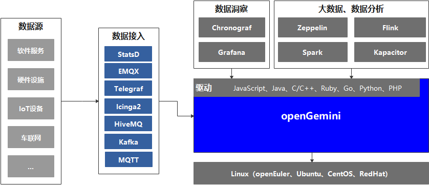

# README


        

简体中文 | [English](README.md)

[官网](http://www.openGemini.org) | [文档](http://www.openGemini.org/docs) | [贡献指南](CONTRIBUTION_CN.md) | [RoadMap](ROADMAP.md)

## 关于openGemini

openGemini是华为云开源的一款云原生分布式时序数据库，可广泛应用于物联网、车联网、运维监控、工业互联网等业务场景，具备卓越的读写性能和高效的数据分析能力，采用类SQL查询语言，无第三方软件依赖、安装简单、部署灵活、运维便捷，鼓励社区贡献、合作。

## 特性

- 高性能读写
  - 每秒千万级指标数据并发写入
  - 万级传感器数据毫秒级响应
- 支持时序数据分析
  - 内置AI数据分析算法
  - 实时异常检测和预测
- 时序生态兼容
  - 完全兼容InfluxDB line protocol 和 Influxql
  - 兼容现有InfluxDB工具链
  - 支持Prometheus远程数据存储
- 分布式  
  - 提供了水平扩展能力，支持数百节点集群规模
- 海量时序数据高效管理
  - 支持亿级时间线管理
  - 内置高效数据压缩算法，存储成本只有传统数据库的1/20
- 灵活部署
  - 部署时只需运行编译生成的可执行文件，无需外部依赖
  - 所有数据库配置参数均有合理的默认值，无需手动设置
  - 支持单机和集群部署
  
## 第三方支持



openGemini目前暂时只支持Linux操作系统，无缝支持InfluxDB生态工具链，比如：

主流开发语言驱动：[JavaScript](https://github.com/node-influx/node-influx)、[Java](https://github.com/influxdata/influxdb-java)、[C/C++]()、[Ruby](https://github.com/influxdata/influxdb-ruby)、[Go](https://github.com/influxdata/influxdb1-client)、[Python](https://github.com/influxdata/influxdb-python)、[PHP](https://github.com/influxdata/influxdb-php)

客户端：ts-cli

数据接入工具：StatsD、EMQX、Telegraf、Icinga2、HiveMQ、Kafka、MQTT

数据洞察工具：Chronograf、Grafana

大数据和数据分析系统：Zeppelin、Flink、Spark、Kapacitor等。

## 快速开始

如需更详细的介绍，请访问官网[用户指南](http://www.openGemini.org/docs)

安装部署、扩节点等相关详细介绍见[openGemini安装部署指南](https://github.com/openGemini/community)

openGemini内部提供了时序异常检测的分析框架、分析算子castor和UDF接口，见官网[用户指南 -> Data Analysis](http://www.openGemini.org/docs)。
openGemini提供了基于AI的时序数据异常检测库，详细可见[openGemini-castor](https://github.com/openGemini/openGemini-castor)

本章节主要包含以下内容：

- 如何编译openGemini源码
- openGemini的启动和运行

### 编译环境信息

[GO](https://golang.org/dl/) version v1.18+

[Python](https://www.python.org/downloads/) version v3.7+

**GO环境变量设置**

打开 ~/.profile配置文件，在文件末尾添加如下配置：

```
export GOPATH=/path/to/dir
export GOBIN=$GOPATH/bin
export GO111MODULE=on
export GONOSUMDB=*
export GOSUMDB=off
```

### 编译

1. 从 GitHub 克隆源代码

```bash
cd $GOPATH
mkdir -p {pkg,bin,src}
cd src
git clone https://github.com/openGemini/openGemini.git
```

2. 进入主目录

```bash
> cd openGemini
```

3. 编译

```bash
> export CGO_LDFLAGS="-Wl,-z,now -Wl,-z,relro -Wl,-z,noexecstack -fPIE -ftrapv"
> export CGO_CFLAGS="-fstack-protector-strong -D_FORTIFY_SOURCE=2 -O2"
> python build.py -clean
```

编译好的二进制在build目录中

```bash
> ls build
ts-cli  ts-meta  ts-monitor  ts-server  ts-sql  ts-store  
```

### 配置

配置文件放置在conf目录下，有关配置项的详细信息，请参见[用户指南-->配置文件](http://opengemini.org/docs)

### 运行openGemini

单机运行，数据目录默认为/tmp/openGemini，使用时请修改单机版的配置文件openGemini.single.conf，更换目录。

```
> cd openGemini
> mkdir -p /tmp/openGemini
> sh scripts/install.sh
```

集群部署见[用户指南](http://opengemini.org/docs)

#### 使用openGemini

使用客户端ts-cli连接openGemini

```
> ts-cli -host 127.0.0.1 -port 8086
```

登陆成功后显示如下信息

```sh
> ts-cli -host 127.0.0.1 -port 8086
openGemini CLI 0.1.0 (rev-revision)
Please use 'quit', 'exit' or 'Ctrl-D' to exit this program
>
```

创建数据库

```
> create database sensordb
> use sensordb
```

openGemini支持三种方式创建measurement数据表

- 隐式创建，即写入数据时自动创建，默认按照时间分区
- 显式创建，不指定分区键，效果与隐式创建一样

```
> create measurement sensor
```

- 显式创建，指定分区键，数据存储时，会首先按照时间进行分区，再按照指定分区键进行二次分区。


```shell
> create measurement sensor with shardkey farmID
```

数据Schemaless写入(样例)

```
> insert sensor,farmID=f1,deviceID=d0 sensorID="s20",value=50.98
```

数据查询(样例)

```
> select * from sensor
name: sensor
+---------------------+----------+--------+----------+-------+
| time                | deviceID | farmID | sensorID | value |
+---------------------+----------+--------+----------+-------+
| 1657959880895515464 | d0       | f1     | s20      | 50.98 |
+---------------------+----------+--------+----------+-------+
5 columns,1 rows in set
Elapsed: 7.723332ms  
```

## 加入贡献

[贡献指南](CONTRIBUTION_CN.md)

## 联系我们

1. 加入WeChat（微信）用户组

   微信添加好友 xiangyu5632, 备注openGemini，我们会邀请您进群

2. 扫描下方二维码关注openGemini公众号

  

3. 社区邮箱   

   community.ts@opengemini.org

4. [邮件列表(mailing list)](https://groups.google.com/g/openGemini)

5. [Slack](https://join.slack.com/t/huawei-ipz9493/shared_invite/zt-1bvxs3s0i-h0BzP7ibpWfqmpJO2a4iKw)

6. [Twitter](https://twitter.com/openGemini)

## License

openGemini采用 Apache 2.0 license. 详细见 [LICENSE](https://github.com/openGemini/openGemini/blob/main/LICENSE) .

