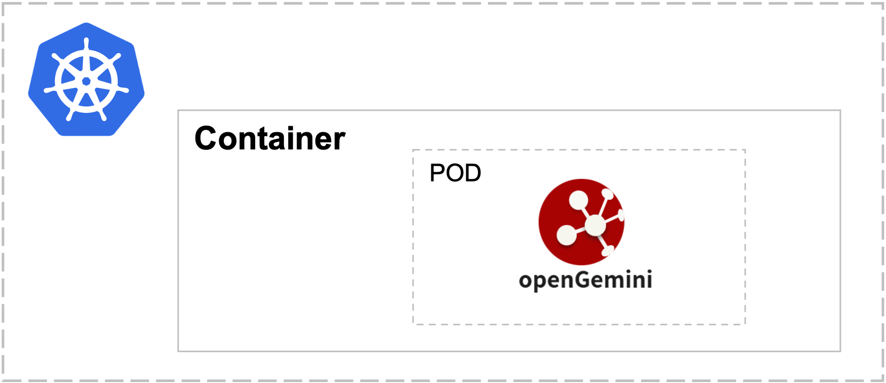
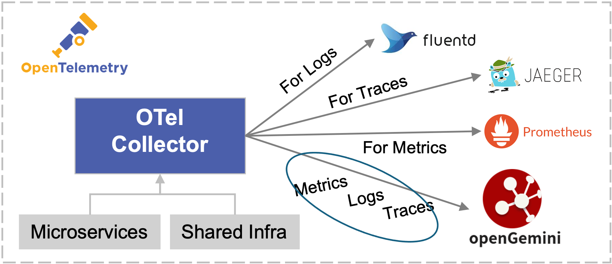
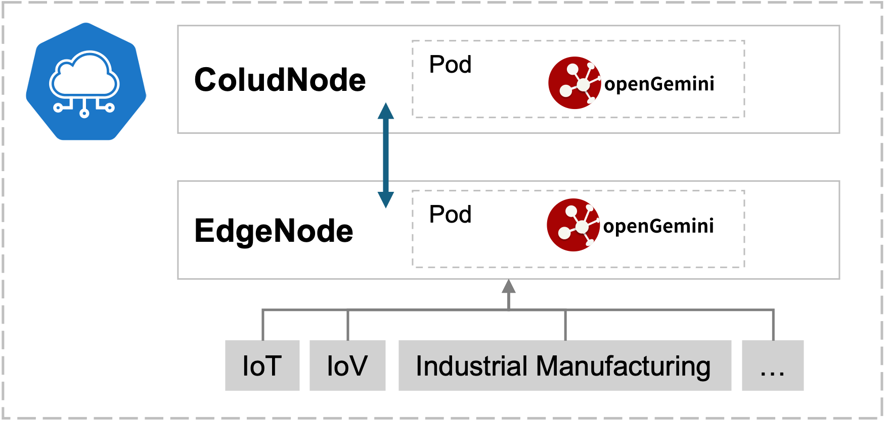
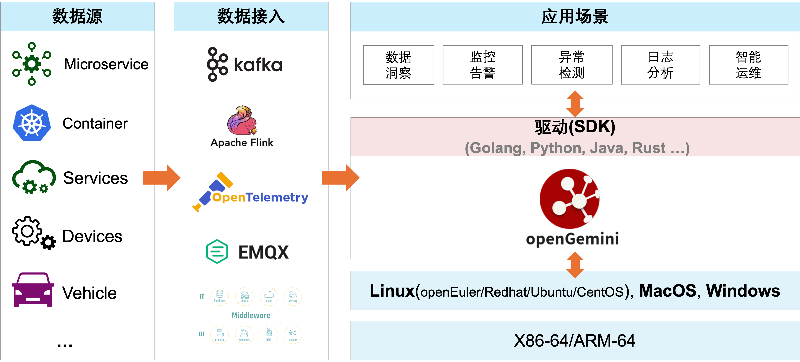

# README


   [](https://github.com/opengemini/opengemini/releases)

[English](README.md) | 简体中文

[官网](http://www.openGemini.org) | [文档](https://docs.opengemini.org/zh/guide) | [贡献指南](CONTRIBUTION_CN.md) | [RoadMap](ROADMAP.md) | [性能](https://docs.opengemini.org/zh/guide/introduction/performance.html)

<picture>
    <source media="(prefers-color-scheme: dark)" srcset="https://next.ossinsight.io/widgets/official/compose-activity-trends/thumbnail.png?repo_id=507829396&image_size=auto&color_scheme=dark" width="815" height="auto">
    
  </picture>


## 关于openGemini

openGemini是一款云原生分布式时序数据库，主要面向物联网和运维监控场景，专注海量遥测数据的存储与分析，可广泛应用于物流、车联网、互联网、智能制造、现代农业、交通、能源、电力和医药等行业，具备卓越的读写性能和高效的数据分析能力，采用类SQL查询语言，无第三方软件依赖、安装简单、部署灵活、运维便捷。

如果您使用了openGemini，请让我们知道，[点击提交使用信息](https://github.com/openGemini/openGemini/issues/62)


openGemini 是云原生计算基金会 (CNCF) 的一个沙箱项目。如果您是一家希望积极支持云原生生态系统成长和发展的组织，请考虑加入 CNCF。

## 特性

与其他开源时序数据库相比，openGemini 具有以下优势：

- #### 高性能

  高吞吐、高并发、低时延。支持数据高速写入，能够快速响应大量查询请求，参考[性能报告](https://docs.opengemini.org/zh/guide/introduction/performance.html)

- #### 高扩展

  采用MPP架构，支持分布式集群部署，集群组件可以随着业务的增长而灵活扩展，以满足更高的负载需求, 支持100+节点，参考[架构设计](https://docs.opengemini.org/zh/guide/introduction/structure.html)

- #### 高基数

  全新存储引擎，不受时间线数量限制，解决时序数据高基数带来的索引膨胀、内存资源占用过高、读写性能下降等问题，参考[高基数存储引擎](https://docs.opengemini.org/zh/guide/features/high_series_cardinality.html)

- #### 灵活部署

  支持单机和集群部署，支持虚拟机、物理机、容器、云等多种形态部署。提供一键容器化部署工具（[openGemini-operator](https://github.com/openGemini/openGemini-operator)）和一键化普通安装部署工具（[gemix](https://github.com/openGemini/gemix)）

- #### 高数据压缩率

  数据采用列式存储，不同数据类型采用专用数据压缩算法，数据压缩比高达15:1或者更高，参考[数据压缩算法](https://docs.opengemini.org/zh/guide/kernel/data_compress.html)

- #### 时序生态兼容

  兼容InfluxDB 1.x 版本的Line Protocol 、Influxql和API接口，兼容现有InfluxDB工具链（如SDK/telegraf..)

## 云原生场景支持

- 容器化部署，[openGemini-Operator](https://github.com/openGemini/openGemini-operator) 支持一键容器化部署

  

- openTelemetry 后端存储, 简化系统架构

  

- Prometheus 后端存储，支持远程 read/write，支持 PromQL

  

- KubeEdge与openGemini集成, 更好管理边缘设备数据

  

## 应用场景



## 快速开始

如需更详细的介绍，请访问官网[用户指南](https://docs.opengemini.org/zh/guide/quick_start/get_started.html)

集群安装部署、扩节点等相关详细介绍见[openGemini安装部署指南](https://github.com/openGemini/community/blob/main/openGemini%20Install%20Guide.md)

本章节主要包含以下内容：

- 如何编译openGemini源码
- openGemini的启动和运行

### 编译环境信息

[GO](https://golang.org/dl/) version v1.20+

[Python](https://www.python.org/downloads/) version v3.7+

**GO环境变量设置**

打开 ~/.profile配置文件，在文件末尾添加如下配置：

```
export GOPATH=/path/to/dir
export GOBIN=$GOPATH/bin
export GO111MODULE=on
export GONOSUMDB=*
export GOSUMDB=off
```

针对v1.3.0版本，需要更新GLIBC版本到[GLIBCXX_3.4.29 或更高](https://blog.csdn.net/weixin_42596778/article/details/141935013)

### 编译

1. 从 GitHub 克隆源代码

```bash
cd $GOPATH
mkdir -p {pkg,bin,src}
cd src
git clone https://github.com/openGemini/openGemini.git
```

2. 进入主目录

```bash
> cd openGemini
```

3. 编译

```bash
> export CGO_LDFLAGS="-Wl,-z,now -Wl,-z,relro -Wl,-z,noexecstack -fPIE -ftrapv"
> export CGO_CFLAGS="-fstack-protector-strong -D_FORTIFY_SOURCE=2 -O2"
> python build.py --clean
```

编译好的二进制在build目录中

```bash
> ls build
ts-cli  ts-meta  ts-monitor  ts-server  ts-sql  ts-store
```

### 配置

配置文件放置在conf目录下，有关配置项的详细信息，请参见[用户指南-->参考指南-->配置文件](https://docs.opengemini.org/zh/guide/reference/configurations.html)

### 运行openGemini

单机运行，数据目录默认为/tmp/openGemini，使用时请修改单机版的配置文件openGemini.single.conf，更换目录，**否则可能产生有数据文件丢失的风险**。

```
> cd openGemini
> mkdir -p /tmp/openGemini
> sh scripts/install.sh
```

集群部署见[用户指南](https://docs.opengemini.org/zh/guide/quick_start/get_started.html)

#### 使用openGemini

使用客户端ts-cli连接openGemini

```
> ts-cli --host 127.0.0.1 --port 8086
```

登陆成功后显示如下信息

```sh
> ts-cli --host 127.0.0.1 --port 8086
openGemini CLI 0.1.0 (rev-revision)
Please use 'quit', 'exit' or 'Ctrl-D' to exit this program
>
```

创建数据库

```
> create database sensordb
> use sensordb
```

openGemini支持三种方式创建measurement数据表

- 隐式创建，即写入数据时自动创建，默认按照时间分区
- 显式创建，不指定分区键，效果与隐式创建一样

```
> create measurement sensor
```

- 显式创建，指定分区键，数据存储时，会首先按照时间进行分区，再按照指定分区键进行二次分区。


```shell
> create measurement sensor with shardkey farmID
```

数据Schemaless写入(样例)

```
> insert sensor,farmID=f1,deviceID=d0 sensorID="s20",value=50.98
```

数据查询(样例)

```
> select * from sensor
name: sensor
+---------------------+----------+--------+----------+-------+
| time                | deviceID | farmID | sensorID | value |
+---------------------+----------+--------+----------+-------+
| 1657959880895515464 | d0       | f1     | s20      | 50.98 |
+---------------------+----------+--------+----------+-------+
5 columns,1 rows in set
Elapsed: 7.723332ms
```

## 加入贡献

[贡献指南](CONTRIBUTION_CN.md)

## 行为守则

openGemini遵循[CNCF 行为守则](https://github.com/cncf/foundation/blob/master/code-of-conduct.md)

## 联系我们

1. 加入微信交流群

   微信添加好友 xiangyu5632, 备注openGemini，我们会邀请您进群

2. 扫描下方二维码关注openGemini公众号


3. 社区邮箱

   community.ts@opengemini.org

4. [邮件列表(mailing list)](https://groups.google.com/g/openGemini)

5. [Slack](https://join.slack.com/t/opengemini/shared_invite/zt-2naig1675-x3bcwgXR_Rw5OwDU5X~dUQ)

6. [Twitter](https://twitter.com/openGemini)

## License

openGemini采用 Apache 2.0 license. 详细见 [LICENSE](https://github.com/openGemini/openGemini/blob/main/LICENSE) .

第三方软件使用声明，见[Open_Source_Software_Notice](./Open_Source_Software_Notice.md)
